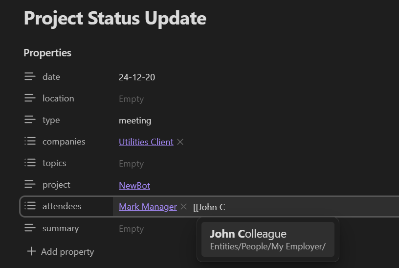
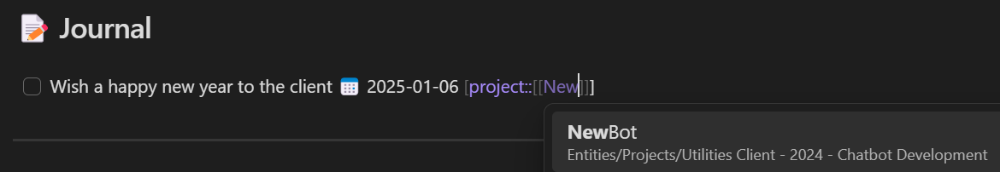

# Obsidian Template

<!-- TOC -->

- [Obsidian-template](#obsidian-template)
  - [Motivation](#motivation)
  - [Contents](#contents)
    - [Templates](#templates)
    - [Dashboards](#dashboards)
    - [Plugins](#plugins)
- [How to use this notebook](#how-to-use-this-notebook)
	- [How to create notes](#how-to-create-notes)
    - [Adding file properties](#adding-file-properties)
    - [How to track tasks](#how-to-track-tasks)
		- [Tracking tasks in meeting minutes](#tracking-tasks-in-meeting-minutes)
	    - [Tracking tasks in daily notes](#tracking-tasks-in-daily-notes)
	    - [Tasks with due date vs. ongoing tasks](#tasks-with-due-date-vs-ongoing-tasks)
	    - [Special tasks](#special-tasks)
	- [Managing meeting notes](#managing-meeting-notes)
	- [Core projects](#core-projects)
- [Final thoughts](#final-thoughts)

<!-- /TOC -->

## Motivation

In my job, I work on different projects for different clients, often simultaneously, all of which come with meetings, tasks, people and information to keep track of. I created this Obsidian template to help me take meeting notes and keep track of tasks, and to be able to get an easy overview of everything that is related to a single project (or client, or topic, or person).

This doesn't only make it easier for me to stay on top of everything, but I have also noticed that it motivates me to take better meeting notes, because I will actually look at them later instead of letting them rot in a OneNote notebook somewhere.

## Contents

### Templates

The templates I use can be found in the [templates folder](https://github.com/StephSabel/Obsidian_Template/tree/main/Templates).

- [Daily note](https://github.com/StephSabel/Obsidian_Template/blob/main/Templates/Daily%20note.md) - A note for every day. Shows your tasks of the day (as well as those that are overdue) and lets you take some daily notes or add some tasks (though I recommend to mostly doing that in meeting notes, [see below](#how-to-track-tasks)) 
- [Meeting](https://github.com/StephSabel/Obsidian_Template/blob/main/Templates/Meeting.md) - My most used template, every meeting gets one. 
- [Company](https://github.com/StephSabel/Obsidian_Template/blob/main/Templates/Company.md) - Create a page about a company, collect notes and info, and receive specific overviews:
	- Projects worked on for this company
	- Contacts that are employed by this company
	- Sales efforts towards this company
	- Meetings where employees of this company participated
- [Contact](https://github.com/StephSabel/Obsidian_Template/blob/main/Templates/Contact.md) - Create a page about a specific person, collect notes and info, and receive specific overviews:
	- tasks to report to them about
	- issues to discuss with them
	- tasks delegated to them 
	- meetings that they participated in
- [Project](https://github.com/StephSabel/Obsidian_Template/blob/main/Templates/Project.md) Create a page about a project, collect notes and info, and receive specific overviews:
	- Open tasks related to this project
	- Delegated tasks related to this project
	- Meetings about this project
- [Topic](https://github.com/StephSabel/Obsidian_Template/blob/main/Templates/Topic.md) Create a page about a topic, collect notes and info, and receive specific overviews:
	- Meetings related to this topic
	- Other related pages

### Dashboards

Dashboards can be found in the [dashboards folder](https://github.com/StephSabel/Obsidian_Template/tree/main/_Dashboards)

- [Today's Tasks](https://github.com/StephSabel/Obsidian_Template/blob/main/_Dashboards/Today's%20Tasks.md) - concise overview of tasks that are due today/overdue as well as ongoing tasks. This is used for a small widget in the right sidebar
- [Tasks](https://github.com/StephSabel/Obsidian_Template/blob/main/_Dashboards/Tasks.md) - the big task dashboard that creates a (more or less structured) overview of everything that is open
- [Meetings](https://github.com/StephSabel/Obsidian_Template/blob/main/_Dashboards/Meetings.md) - this dashboard keeps you accountable to make sure you properly post-process your meeting notes. read more in [Managing meeting notes](#managing-meeting-notes)
- [Contacts](https://github.com/StephSabel/Obsidian_Template/blob/main/_Dashboards/Contacts.md) - just in case you need an overview of all your contacts

### Plugins

These are the community plugins I use in my notebook:
- [Calendar](https://github.com/liamcain/obsidian-calendar-plugin) - to add a calendar widget in the top right
- [Dataview](https://github.com/blacksmithgu/obsidian-dataview/) - to create many of the automatic overviews
- [QuickAdd](https://github.com/chhoumann/quickadd) - to easily create notes using a specific template and following specific rules
- [Style Settings](https://github.com/mgmeyers/obsidian-style-settings) - to add CSS style snippets, fixing some layout things
- [Tasks](https://github.com/obsidian-tasks-group/obsidian-tasks) - to create, track, manage and list tasks
- [Templater](https://github.com/SilentVoid13/Templater) - to create some of the templates

## How to use this notebook

I have developed certain workflows that I feel let me get the most out of this template.

### How to create notes

In theory, you can just use `CTRL + N` or the "compose note" button at the top left to create a new note. However, the only place I use that function is in the *Knowledge Base*. To create ordered notes from the templates, there are two easy ways:

1. For daily notes, click the daily note button (teal) on the menu bar on the very left.
2. For meetings, companies, contacts, project and topics click the QuickAdd button (magenta). This will open a prompt depending on the template.
	- For meetings, companies and topics, you just need to enter a name
	- For projects, you first need to enter the name of the company, then the name of the project.
		- It's not strictly necessary to create a page for the company before creating the page for the project, but I try to do it anyway
	- For contacts, you first need to enter the name of the company they work for (to make sure the page gets created in the right folder), and then the name of the person
		- Again, it's not necessary to create the company page beforehand, but don't forget to do it eventually!

### Adding file properties

File properties are vital to fill all the dataviews, so it's important to stay on top of them. Some of them (like the company associated with a contact or a project) will be filled in automatically, but most need to be done manually. Sorry!

The place you will need to do this most regularly is in meeting notes. 

**IMPORTANT**: Add companies, projects, people and topics as links by using double brackets. This is necessary for some of the dataviews to work. Additionally, it ensures that the spelling is identical, and you can just click the link in your meeting to navigate to the project, the company or one of the attendees. Neat! 

Obsidian will remember which pages you linked previously in which kind of property and will offer you an easy drop-down selection in the future.

### How to track tasks

The task plugin is pretty powerful and allows you to do many different things including defining due dates, start dates, recurrence, priorities, dependencies and much more. Check out the [User Guide](https://publish.obsidian.md/tasks/Getting+Started/Getting+Started)!
#### Tracking tasks in meeting minutes

For me, most tasks result from meetings, and so meeting minutes are the main way for me to create new tasks. The great thing about this is that they are automatically associated with the project that is linked in the file properties.

#### Tracking tasks in daily notes

I prefer not to do this, since daily notes are not associated with projects. If I have an intense period of working on a project by myself, that will result in several new tasks, I will usually create a "meeting" to take notes and create tasks in, because this results in a page that is focused on the work I did in that time, and comes with a link to the project as well as a summary.

But if it's just a small task that I need to track, there is still a way to associate it with a project from the daily note page: [Inline fields](https://blacksmithgu.github.io/obsidian-dataview/annotation/add-metadata/#inline-fields).

This results in this neat look (courtesy of [one of the CSS snippets](https://github.com/StephSabel/Obsidian_Template/blob/main/.obsidian/snippets/dataview-inline-fields.css))

**TIP**: Use [aliases](https://help.obsidian.md/Linking+notes+and+files/Aliases) for your project to make the name shorter!

#### Tasks with due date vs. ongoing tasks

It is probably best for everyone to figure out for themselves how they want to deal with due dates for tasks, whether to use fixed due dates ever time, whether to add start dates ever time or not, etc.

Here is how I do it:
- Tasks that can be done relatively quickly get a due date.
	- Starting from the due date, and until they are done, they will show up under "Today's Tasks" in the task widget in the right sidebar
	- They will also show up in the daily notes
- Tasks that are more long term (like "Study for certification XYZ") don't necessarily get a due date, but they do get a start date. 
	- This means that after the start date, they will start showing up under "Ongoing work" in the task widget in the right sidebar.
	- They will, however, not show up in the daily notes

#### Special tasks

- Delegated tasks: Sometimes, you delegate a task but really want to follow up on if it's done afterwards
	- Use the inline field `[delegated::[[Person]]]`  to do this
- Reporting tasks: Sometimes, it is really important to report on the result of a task to someone else
	- Use the inline field `[reporting::[[Person]]]` to do this
- Agenda tasks: Is there something you really want to talk about with someone?
	- Use the inline field `[agenda::[[Person]]]` to do this

### Managing meeting notes

Meeting notes are the most powerful source of information in this setup, so it's important that we keep them in order. 

NOTE: Meeting notes don't necessarily have to be about a meeting - you can also use them to gather your own thoughts. If you want, you can note this in the "type" property.

These are my principles for keeping meeting notes:
- Project and attendees should be linked in the file properties
	- If I'm just using the template for my own thoughts, there won't be other attendees of course
- If people from a different company are attending the meeting, add the company to the file properties
	- if it's just my own colleagues, don't add a company to the properties
- After the meeting is over (this can be immediately, or days later, depending on current work demands), go over the notes to see if any tasks result from the meeting and add them to the "Next steps" section
- Only once all tasks have been extracted and all other properties are filled in, add a summary for the meeting in the file properties
- Use the [Meetings](https://github.com/StephSabel/Obsidian_Template/blob/main/_Dashboards/Meetings.md) dashboard to check which meetings are lacking a summary and therefore still need to be reviewed

### Core projects

In addition to the projects for clients, there is of course some internal work as well. I have created three core projects to structure this.

- [Career](https://github.com/StephSabel/Obsidian_Template/blob/main/Entities/Projects/Core/_Career.md) - for everything related to my personal development. Meetings with supervisors, goals, etc.
- [Client Development](https://github.com/StephSabel/Obsidian_Template/blob/main/Entities/Projects/Core/_Client%20Development.md) - this is a catch-all for everything to do with sales processes. 
	- When creating a meeting under "Client Development", I like to add the company that this is for in the file properties
		- (This is the only time I will add a company in the file properties without them participating in the meeting)
		- There is a dataview on the page that aggregates all meetings sorted by company
- [Hobbies](https://github.com/StephSabel/Obsidian_Template/blob/main/Entities/Projects/Core/_Hobbies.md) - this is a catch-all for pretty much everything else internal
	- I try to cluster these activities by "topic", meaning that I need to add a topic in the file properties of each meeting associated with this
		- There is a dataview on the page that aggregates all meetings together with the topic

## Final thoughts

- There are tons of user generated themes to choose from. My personal favorite is [Royal Velvet](https://github.com/caro401/royal-velvet)
- There are also tons of user generated plugins, here are some great ones:
	- [Excalidraw](https://github.com/zsviczian/obsidian-excalidraw-plugin) - if you like drawing graphs and things
	- [Advanced Tables](https://github.com/tgrosinger/advanced-tables-obsidian): - using tables in markdown can be a bit of a pain, this helps
	- [Local Backup](https://github.com/ifgris/obsidian-local-backup) - if you like to play around and sometimes mess things up, use this to set up regular local backups
- Have fun! I really hope this helps somebody out!

